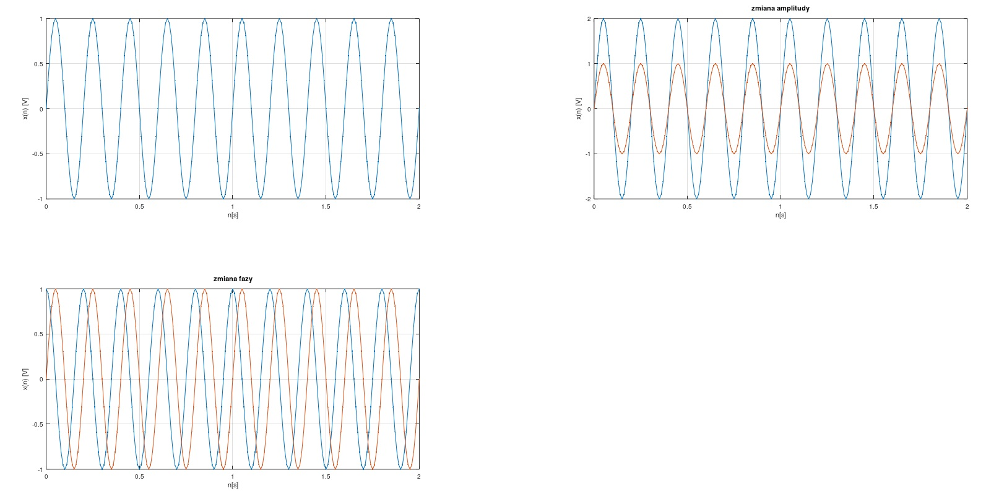
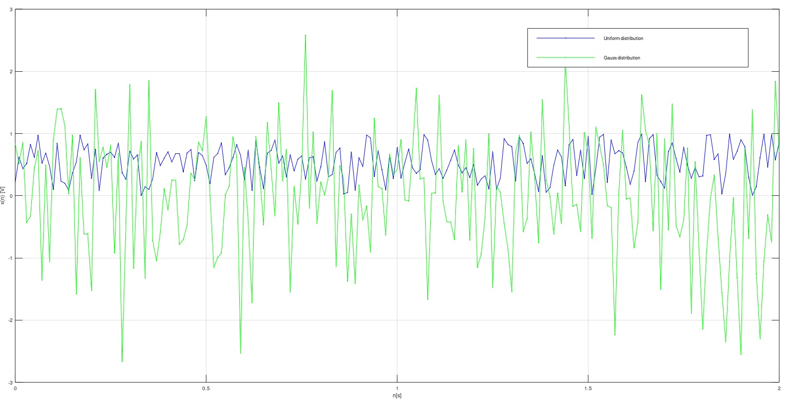

# Wprowadzenie do pakietu Octave

## Ćwiczenie 1
Wygenerować sygnał sinusoidalny o częst. probkowania fs=1000 Hz i częst. sygnału wybranej z przedziału f∈(10,200) Hz. Czas trwania sygnału należy wybrać z przedziału T∈(75,225) ms.

## Ćwiczenie 2
Wygenerować sygnał sinusoidalny o częst. probkowania wybranej z przedziału fs∈(700,1500) Hz i częst. sygnału wybranej z przedziału f∈(10,200) Hz. Długość sygnału (ilość próbek) należy wybrać z przedziału N∈(512,2000).

## Ćwiczenie 3
Na co wpływa amplituda A? Na co wpływa faza ϕ?

`Faza ϕ` - powoduje przesunięcie sinusoidy na osi OX. Przykładowo przesunięcie funkcji sinus o ϕ = π/2 daje nam funkcję cosinus.

`Amplituda A` - rozsunięcie względem osi OY (podobnie jak przemnożenie funkcji przez stałą)



## Ćwiczenie 4
Wygenerować i narysować sygnał będący sumą trzech sinusów o różnych częstotliwościach i amplitudach.

## Ćwiczenie 5
Wygenerować sygnał prostokątny przeprowadzić eksperymenty dla różnego stopnia wypełnienia.

Do wygenrowanie sygnału prostokątnego może być przydatna funkcja [square()](https://octave.sourceforge.io/signal/function/square.html). Jest ona częścią pakietu [signal](https://octave.sourceforge.io/signal/index.html). Wystarczy pobrać pakiet, przejść do command window w octave i zainstalować pakiet i go załadować.

```
>> pkg install signal-x.y.z.tar.gz
>> load signal
```

Sprawdzenie listy zainstalowanych pakietów

```
>> pkg list
```

## Ćwiczenie 6
Wygenerować sygnał losowy (Gausowski) - funkcja randn() i drugi sygnał losowy funkcja rand().



## Ćwiczenie 7
Wygenerować impuls jednostkowy (prawdopodobnie coś podobnego do delty Diraca). 

## Ćwiczenie 8
Wygenerować sygnał liniowy y=2x−3 w zakresie x∈(−3:5) i nieliniowy y=x^2+2x−1  w zakresie zmienności x∈(−4:2).

## Ćwiczenie 9
Wygenerować sygnał testowy - funkcja sinus z dodanym szumem - o następujących parametrach:
- częstotliwość próbkowania 717 Hz
- długość sygnału 512 próbek
- częstotliwości sinusoidy π Hz
- amplituda sinusoidy 3
- moc szumu dodanego do sinusoidy wynosi 0.2 (czyli 0.2*szum)

## Ćwiczenie 10
Przebieg funkcji nieliniowej= y=2x^3−x^2/2+x−2, x∈<−3,3>.

## Ćwiczenie 11
Wygenerować sygnał testowy zawierający sumę sygnału cos o częstotliwości π i szumu o rozkładzie Gaussa. Czas trwania sygnału wynosi π/2.

Należy narysować sygnał wynikowy oraz policzyć `SNR` (ang Signal to Noise Ratio). Podpowiedź moc sygnału i moc szumu można policzyć pod warunkiem, że oba sygnału będą zapamiętane w innych zmiennych. Wtedy wystarczy policzyć iloczyn skalarny tych zmiennych.

Postać sygnału:

x(`t`)=A*sin(2\*π\*f\*`t`+ϕ)