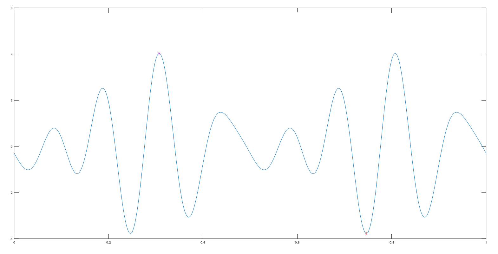
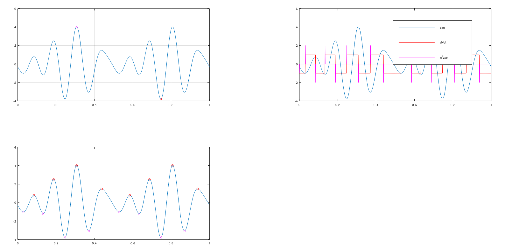

# Wprowadzenie do pakietu Octave

W octave 

## Ćwiczenie 1
Napisać funkcję, która zwróci liczby pierwsze z podanego zakresu.

## Ćwiczenie 2
Napisz funkcję, która wyliczy maksymalną i minimalną wartość sygnału, gdzie sygnałem jest suma trzech sygnałów sinusoidalnych o różnych amplitudach, częstotliwościach i fazach

## Ćwiczenie 3
Zobaczyć jak działają i co robią funkcje zeros(), ones(), eye(). Dodatkowo:
- dodać przykładową macierz ręcznie, 
- pomnożyć przez stałą, 
- przez wektor jednostkowy,
- przez wektor o dowolnych wartościach
- przez macierz jednostkową
- transponować macierz

## Ćwiczenie 4
Podobnie jak w Ćwiczeniu 2, tylko tutaj mamy obliczyć wszystkie maksima lokalne funkcji.

