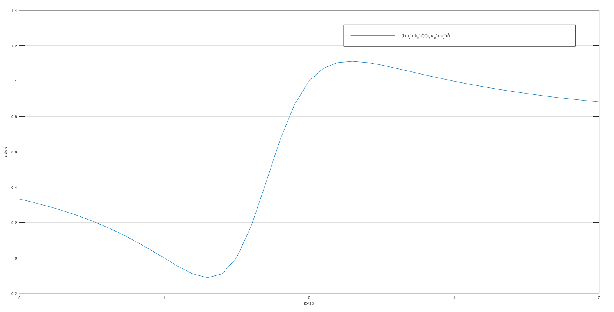
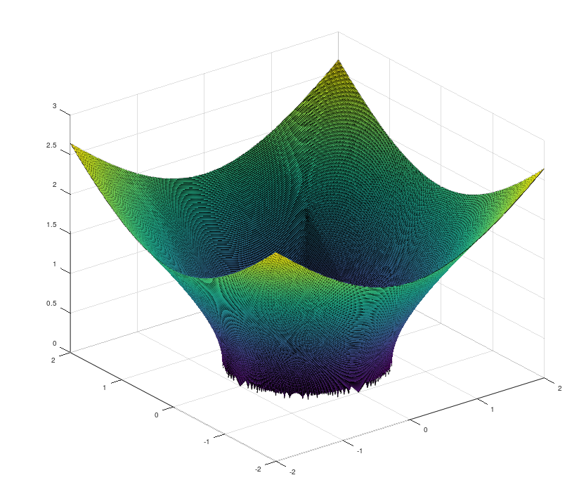
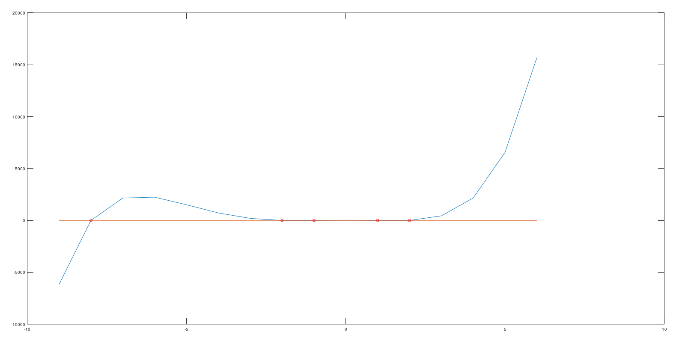
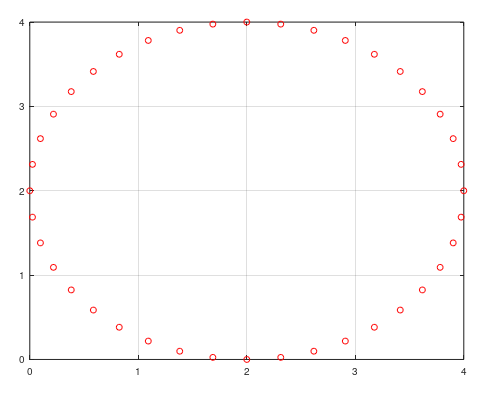
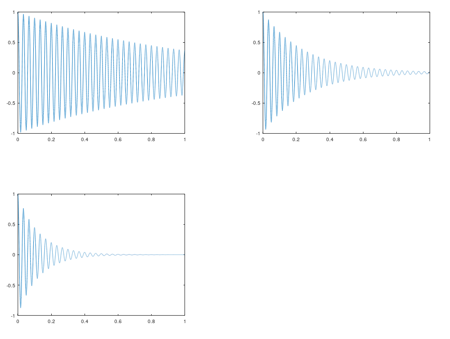
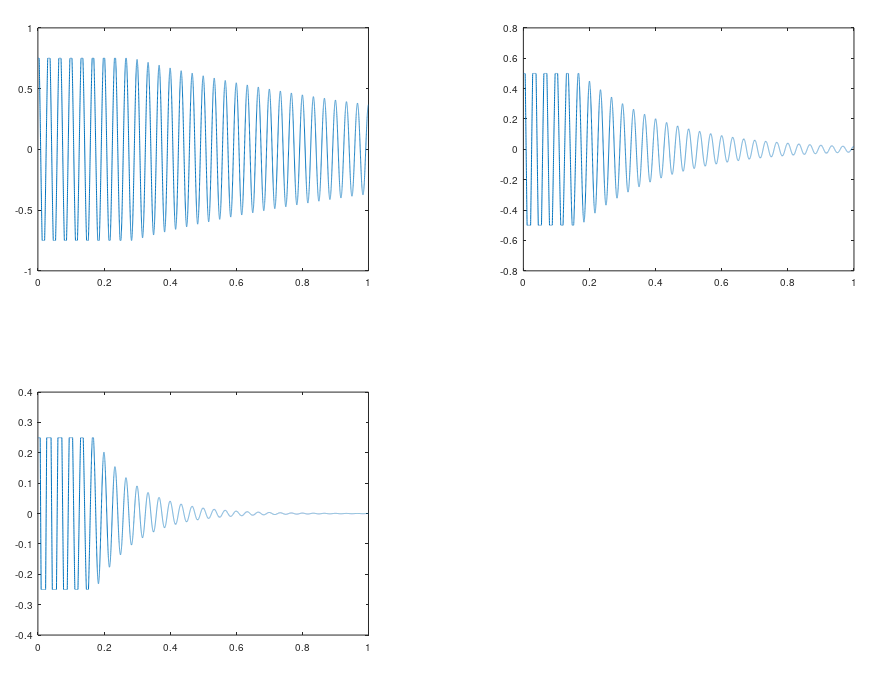

# Programowanie w pakiecie Octave

W octave wszystkie macierze indeksujemy od 1, zatem nie ma elementu o indeksie 0. 

## Ćwiczenie 1
Napisać funkcję, która zwróci liczby pierwsze z podanego zakresu.

## Ćwiczenie 2
Napisz funkcję, która wyliczy maksymalną i minimalną wartość sygnału, gdzie sygnałem jest suma trzech sygnałów sinusoidalnych o różnych amplitudach, częstotliwościach i fazach

## Ćwiczenie 3
Zobaczyć jak działają i co robią funkcje zeros(), ones(), eye(). Dodatkowo:
- dodać przykładową macierz ręcznie, 
- pomnożyć przez stałą, 
- przez wektor jednostkowy,
- przez wektor o dowolnych wartościach
- przez macierz jednostkową
- transponować macierz

## Ćwiczenie 4
Podobnie jak w Ćwiczeniu 2, tylko tutaj mamy obliczyć wszystkie maksima lokalne funkcji.

## Ćwiczenie 5
Napisz funkcję, która podzieli dwa wielomiany zgodnie z formułą
y(x)=1+b1x+b2x^2/a0+a1x+a2x^2 dla x∈<−T,T> z krokiem np. 0.01. Współczynniki wielomianu (należy zadać jako wektory a i b ), T oraz krok zmienności 1/Fs są parametrami wejściowymi funkcji. Wykorzystać instrukcję nargin/nargout, odpowiedno podpisać osie i zrobić legendę. 

## Ćwiczenie 6
napisać funkcję, która dla wektorów x i y rozpiętych w przedziale (-2,2) z dowolnym krokiem będzie rysować hiperboloidę określoną wzorem
x^2+y^2−z^2=1

z(x,y)=√x2+y2−1.

## Ćwiczenie 7
Napisać funkcję, która narysuje przebieg generowany przez wielomian, zaznaczy na wykresie jego miejsca zerowe (pierwiastki) i zwróci wektor wartości wielomianu oraz wektor pierwiastków rzeczywistych wielomianu (czyli wektor tzw. miejsc zerowych wielomianu). Funkcja ma dwa parametry wejściowe:
- wektor współczynników wielomianu,
- wektor zmiennej niezależnej

## Ćwiczenie 8
Proszę napisać funkcję, która wyznaczy punkty okręgu metodą przesuwania się o wyznaczony kąt. Środek okręgu znajduje się w punkcie początkowym. Funkcja ma trzy argumenty wejściowe:
- promień okręgu,
- punkt początkowy/startowy
- ilość punktów okręgu (lub alternatywnie przyrost kąta dla każdego kolejnego punktu).
Funkcja zwraca macierz, której kolejne wiersze to współrzędne (x,y) kolejnych punktów.

W przypadku braku argumentów/parametrów wyjściowych w wywołaniu funkcji (nargout==0) należy wyplotować/narysować wyznaczony okrąg.

## Ćwiczenie 9
Funkcja ma zwracać wektor trzech wartości czasu, dla których amplituda zanikających funkcji cos() jest mniejsza niż amplituda "odcięcia". Zanikająca funkcja cos() jest opisana wzorem

xi(t)=cos(2πft)e^(−Mit),

gdzie Mi to jedna z trzech wartości z wektora M.

Poniżej po uwzględnieniu amplitudy odcinającej.

