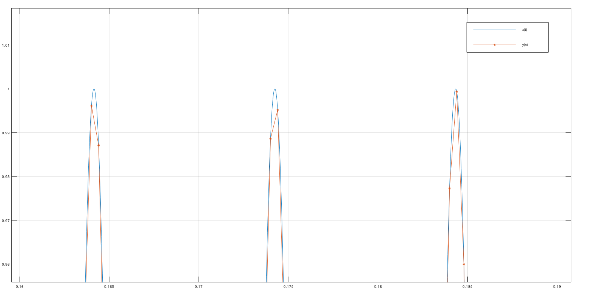
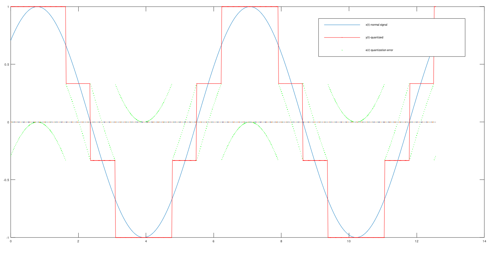
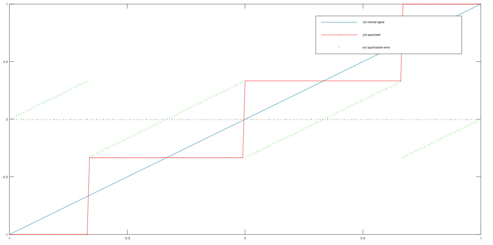
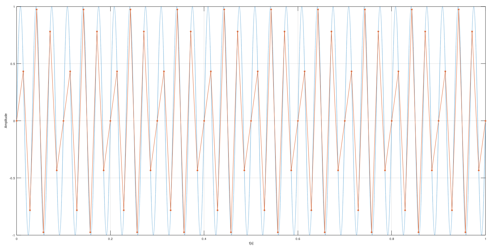
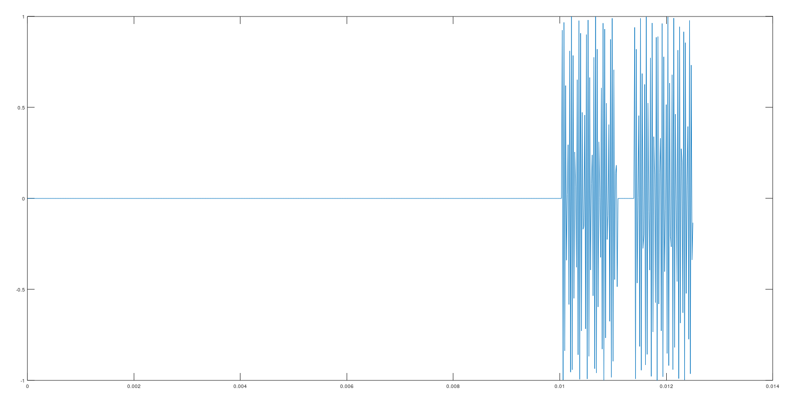
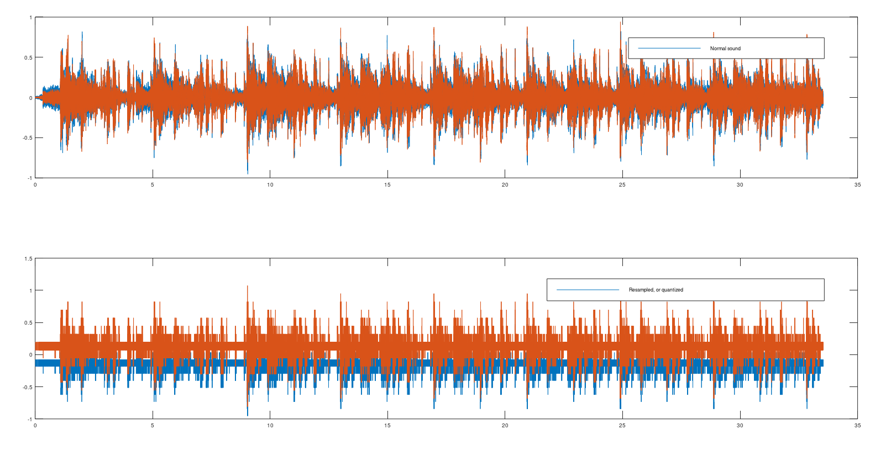
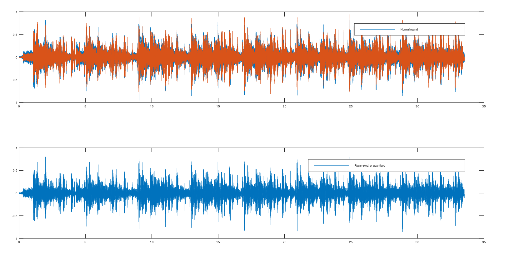

# Próbkowanie i kwantyzacja

## Ćwiczenie 1
Wygenerować sygnał sinusoidalny od długości 1s, częst. 99Hz tak żeby było 100tyś punktów (czyli częśtotliwość próbkowania 100kHz) ten sygnał będzie naśladował sygnał pseudociągły. Stworzyć nowy sygnał przez decymacje pierwszego (np. wybieramy co 10 probkę czyli zmniejszamy częt próbkowania 10 razy). Narysować oba sygnały na jednym wykresie.

## Ćwiczenie 2
Napisać własną funkcję do kwantyzacji z podaną liczba bitów przetwornika.Ekperymentować z napisaną funkcją na sygnale linii prostej i sygnale sinusoidalnym. Policzyć i narysować na wspólnym wykresie sygnał błędu kwantyzacji (wraz z sygnałem oryginalnym i skwantowanym).

## Ćwiczenie 3 
Napisać skrypt wykorzystujący funkcję kwantyzacji (własną lub z matlaba) do wyznaczenia zależności SQNR (Signal to Quantization Noise Ratio) od liczby bitów przetwornika B.

SQNR=10*log10(Px/Pe),

gdzie Px to moc sygnału przed kwantyzacją, Pe to moc sygnału błędu (szumu) kwantyzacji.

Jako efekt wielokrotnej symulacji powinniśmy uzyskać błąd SNR zależny od liczby bitów przetwornika. Funkcja ta powinna być linią prostą opisaną zależnością:

SQNR= 6.02B

Warto wyznaczyć tę zależność dla różnych sygnałów: 
- liniowy narost sygnału czyli y=x, 
- sinus, 
- szum normalny/gaussowski.

## Ćwiczenie 4
Napisać funkcję, która wyznaczy częstotliwość sygnału cosinusoidalnego po zajściu zjawiska aliasingu dla dowolnych wartości rzeczywistych częstotliwości sygnału i dla dowolnej częstotliwości próbkowania. W przypadku braku argumentów wyjściowych należy narysować wykres sygnału ciągłego (przed próbkowaniem) i dyskretnego zgodnie z przekazaną do funkcji częstotliwością próbkowania.

Inaczej mówiąc funkcja ma dwa argumenty wejściowe (w tym przypadku liczby): częstotliwość sygnału i częstotliwość próbkowania, a jako wynik wylicza częstotliwość sygnału cyfrowego (po próbkowaniu; dla odpowiednio dobranych argumentów wej. zachodzi aliasing).

fp=|f-fs*NINT(f/fs)|

https://www.translatorscafe.com/unit-converter/pt-PT/calculator/aliasing-frequency/

## Ćwiczenie 5
W pokoju laboratoryjnym zamontowano w jego narożnikach dwa nadajniki ultradźwiękowe emitujące co jedną sekundę falę sinusoidalną o częstotliwościach odpowiednio 28.71kHz i 27,13kHz. Długość każdego z tych sygnałów jest równa precyzyjnie 30 okresów sinusoidy. Odległość między narożnikami pomieszczenia wynosi 6.5m. W pokoju znajduje się odbiornik(mikrofon) ultradźwiękowy. Umieszczono go w punkcie oddalonym o [1.5m,3m] mierząc równolegle do ścian od narożnika pierwszego. Zakładając, że oba nadajniki zaczynają nadawanie sygnału w tej samej chwili (umownie jest to czas t=0s) oraz, że prędkość fali ultradźwiękowej w powietrzu wynosi 344m/s wyliczyć sygnał zarejestrowany przez mikrofon. Należy zaniedbać szumy i efekty propagacji fali (osłabienie, odbicia itp.) z wyjątkiem opóźnienia sygnału w czasie.

## Ćwiczenie 6
Wczytać dowolny plik wav do octave, odtwarzanie dźwięku, ekperymenty z kwantyzacją dla 1, 2,... bitów i odsłuchiwanie dźwięku, eksperymenty z resamplingiem (zmiana częstotliwości próbkowania) sygnałów dźwiękowych i odsłuchiwanie dźwięku

>Kwantyzacja 4 bity, dźwięk zaszumiony.

>d=8, wybór co ósmego sampla, dźwięk wytłumiony.