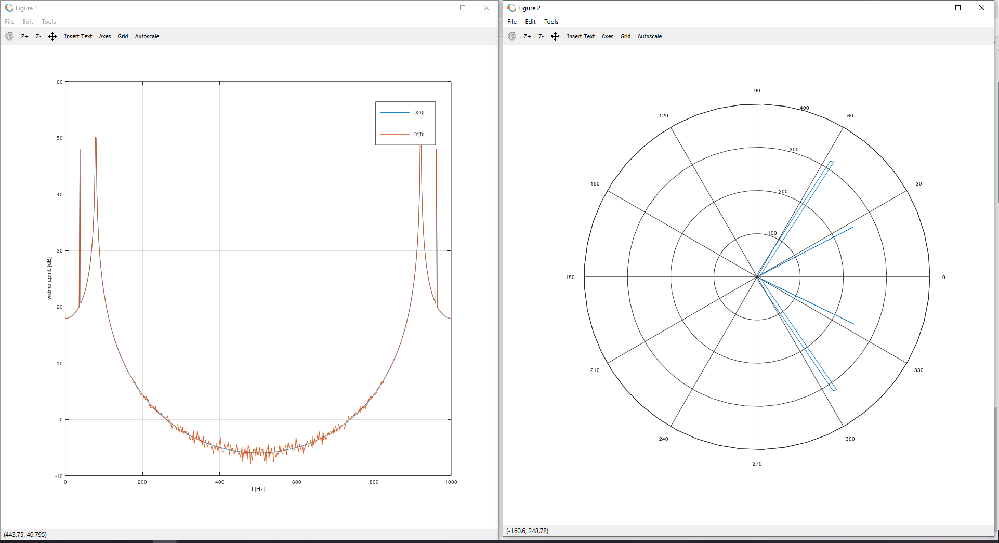
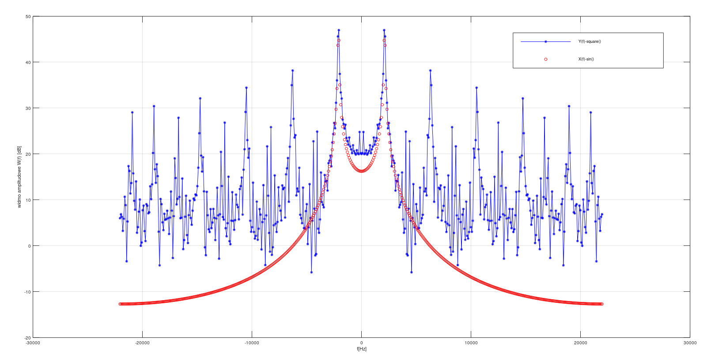
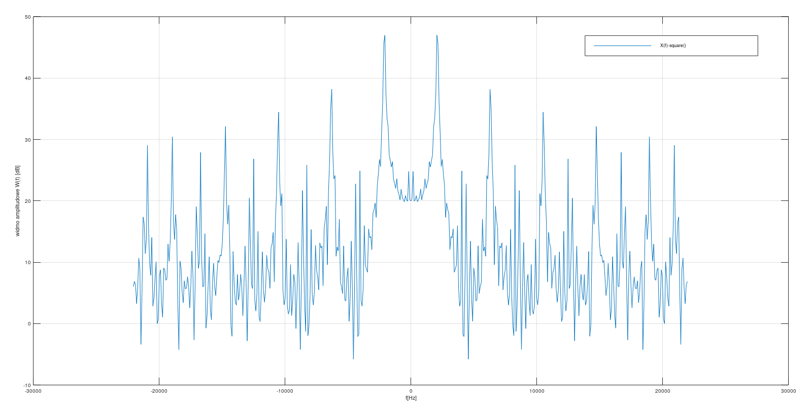
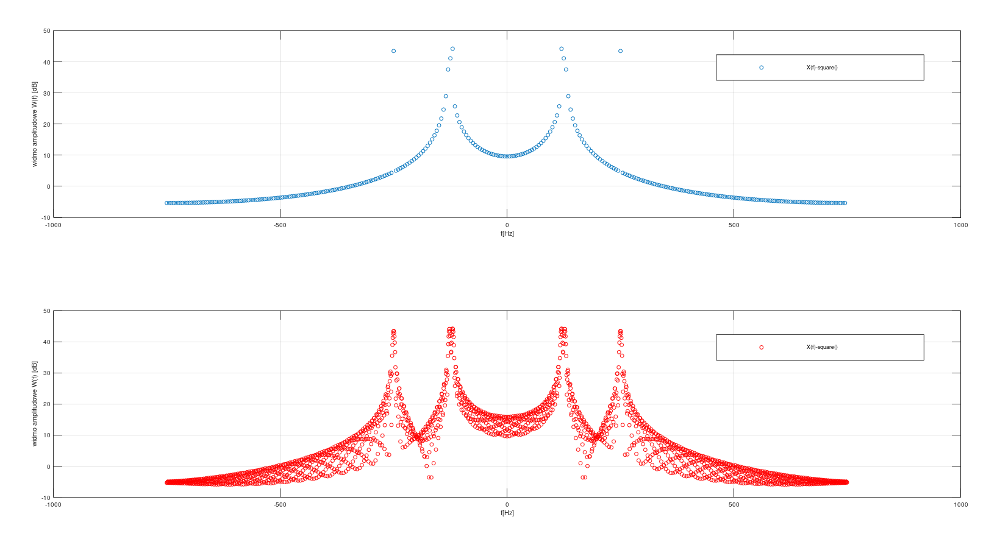
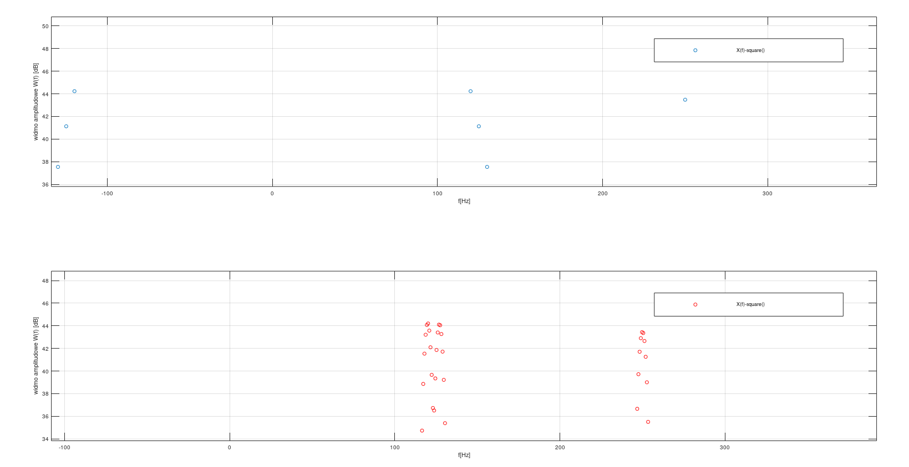
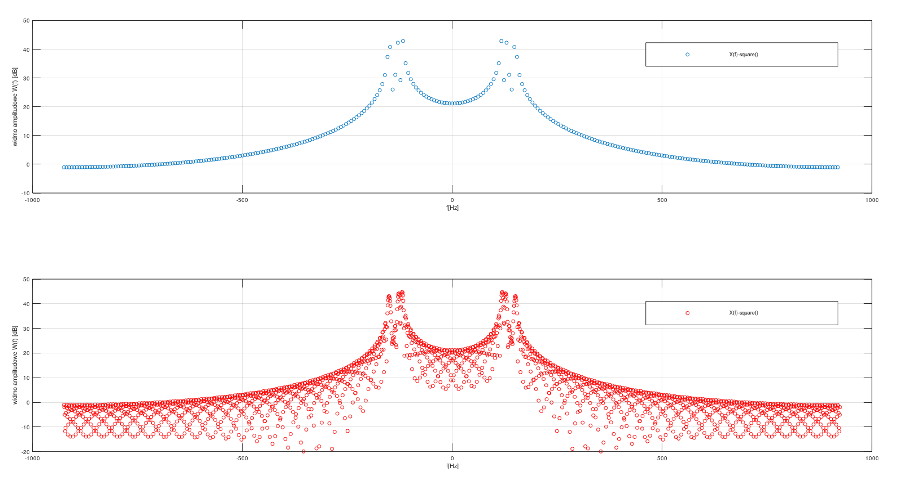

# Transformata Fouriera i widmo sygnału

## Ćwiczenie 1
- wygenerować sygnał złożony z dwóch lub więcej przebiegów okresowych
- dodać szum biały w określonej proporcji SNR (używając np. randn() lub awgn())
- narysować wykres widma amplitudowego (koniecznie w [dB] 20*log10(abs(X)))
- narysować wykres widma fazowego angle(); widmo fazowe jest okresowe w okresie 2π a zatem można je rozwinąć unwrap()

## Ćwiczenie 2
Aliasing w dziedzinie częstotliwości

Dla wskazanej przez prowadzącego częstotliwości próbkowania (np. fs=44100 i wybranej częstotliwości (np. fsyg=2107Hz) sygnału prostokątnego:
1) wyliczyć częstotliwość podstawową generowanego sygnału oraz częstotliwości harmoniczne (3-cią i 5-tą) z uwzględnieniem aliasingu w procesie próbkowania
2) wyznaczyć widmo sygnału spróbkowanego używając funkcji fft() z Matlaba
3) narysować widmo amplitudowe i sprawdzić czy jest zgodne z wyliczeniami z pkt. 1) - uwaga - Bardzo ważny jest opis osi OX w zakresie (−fs/2:fs/2) i skala [dB]

Tu dla porównania wykrsu widma można porównać z funkcją sin();

## Ćwiczenie 3
Tak jak 3 tylko rozpatrujemy sam sygnał prostokątny.

## Ćwiczenie 4

Przeciek widma
Dla podanych parametrów:
- długość sygnału 300 próbek
- częstotliwość próbkowania fs=1500Hz
wygenerować sygnał będący sumą szumu białego i trzech sygnałów sinusoidalnych o częstotliwościach odpowiednio 120Hz, 127Hz, 250Hz. Stosunek mocy sygnału zawierającego trzy składowe sinusoidalne do mocy sygnału szumu - SNR - musi wynosić 35dB.
1) Następnie policzyć widmo amplitudowe i zaprezentować je na wykresie w zakresie (-fs/2,fs/2). Uwaga - przy prezentacji widma amplitudowego obowiązuje skala [dB] !!!
2) Skomentować uzyskany wynik, ze szczególnym uwzględnieniem efektów przecieku widma.
3) Zwiększyć sztucznie rozdzielczość widma przez dodanie zer do sygnału tak aby uzyskać 2048 próbek transformaty i ponownie narysować widmo jak w punkcie 1)
4) Skomentować uzyskany wynik ze szczególnym uwzględnieniem wpływu dodawania zer do sygnału na widmo amplitudowe.

Komentarz do wykresu
>Widac przeciek widma dla częstotliwosci 127 Hz, ktora też przecieka do 120 Hz. Powodem tej sytuacji jest zbyt małą ziarnistość częstotliwości, zwaną rownież
rozdzielczościa. Wartość ta określa co ile pkt jest wyznaczana wartosc prazków dtf/fft.
Rozdzielczosc mozna wyliczyc korzystajac z wzoru f=fs/N
>- fs->czestotliwosc probkowania
>- N-> liczba probek
>Ze wzgledu ze tf jest wyznaczana dla 125 i 130 to enegia z 127 przecieka na sąsiednie prążki. Z tego powodu f1 i f2 zlewa sie w jeden szczyt w widmie.

>W celu zniwelowania zjawiska przcieku widma można zwiększyć rodzielczość widma poprzez sztuczne zwiększenie rozdzielczości widma poprzez dopisanie zer.

Po sztucznym zwiększeniu rodzielczości nadal widać lekki przeciek widma, jednak teraz możemy wyróżnić częstotliwość 125 Hz i coś w okolicach 127 Hz i tutaj następuje lekki przeciek widma do sąsiednich próżków 128 i 130.

Przeciek jest to zjawisko, w którym dowolny sygnał wejściowy, którego częstotliwość nie jest dokładnie równa częstotliwości dla której jest wyznaczony dany prążek dft przecieka do sąsiednich prążków.

## Ćwiczenie 5
Podobne do 4 z tym że częstotliwości są tak dobrane, aby dla każdej częstotliwość można było zaobserwować zjawisko przecieku widma.

